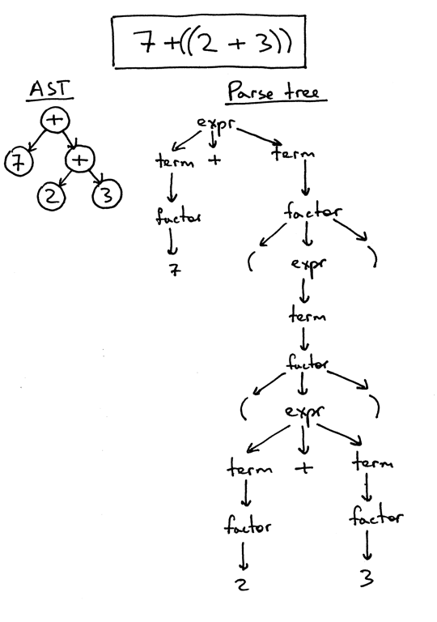
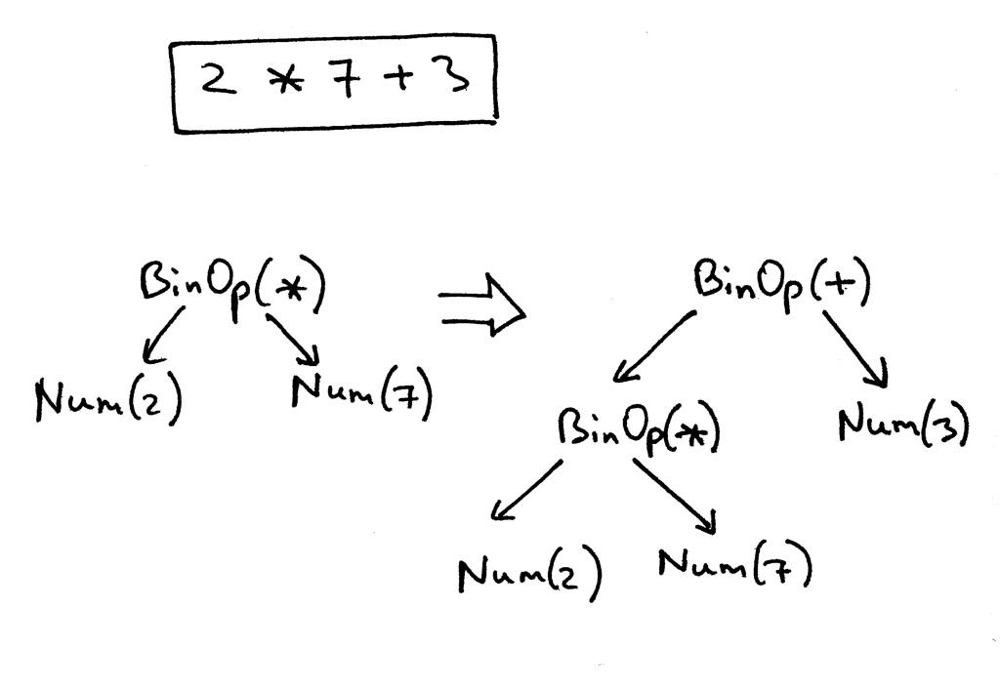
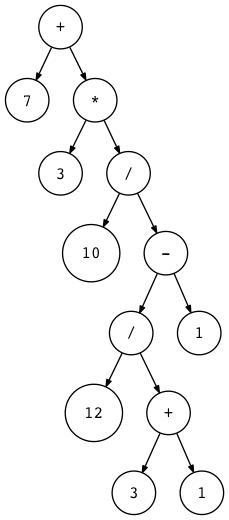
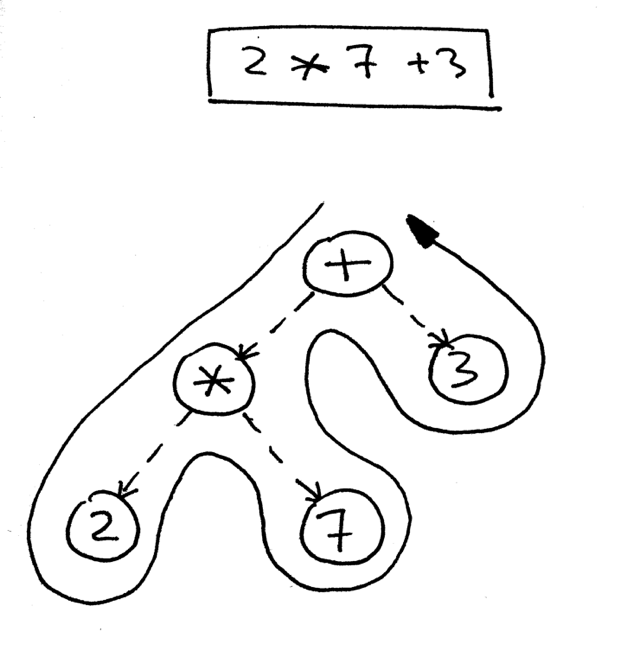
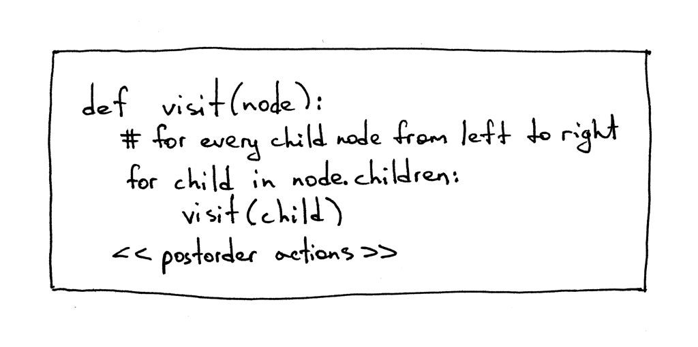
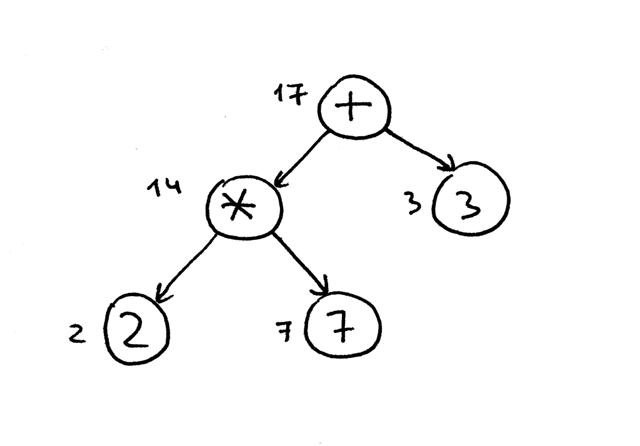
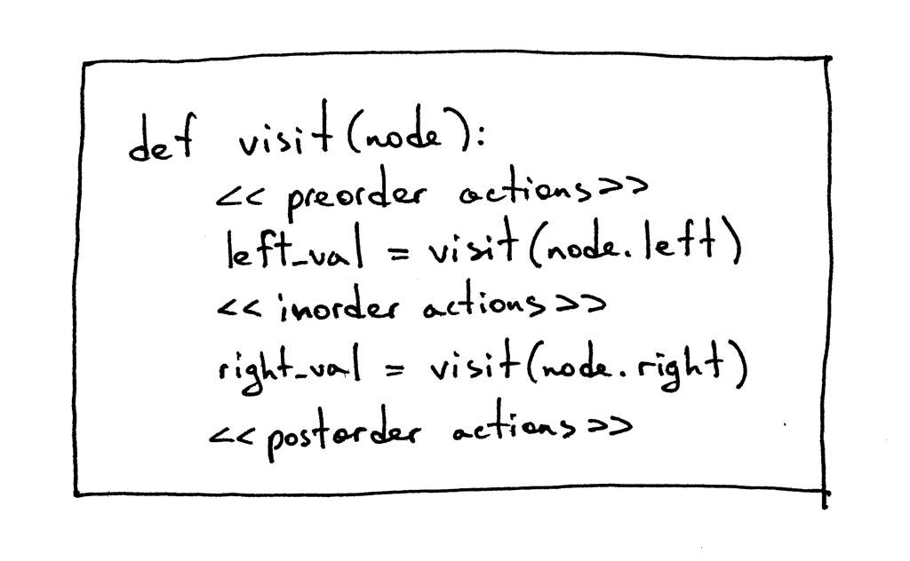

# *Let's Build a Simple Interpreter* Part 7: 抽象语法树

像我上次承诺的那样，今天我要对一些将要用的本系列文章结束时的核心数据结构展开讨论。准备好了吗？要出发了。

直到现在，我们已经把解释器和解析器的代码集成到一起了，并且使它可以在识别到确定的语法结构时，可以计算表达式的值，例如加减乘除等。这样的解释器我们称为**语法制导**的解释器。这类解释器通常会遍历一次输入，适用于基础的语言应用。为了分析更复杂的Pascal语言的语法结构，我们需要构建语言的中间表示（Intermediate Representation，IR）。我们的解析器需要构建正确的IR，而计时器将利用它去解释执行由IR表述的输入。

这样一来，二叉树（或者更广泛意义上的树）是一种非常适合表示表示IR的数据结构。


让我们来迅速的回顾一下二叉树的术语：

- 二叉树是一种由至少一个节点、带有层次结构的数据结构；
- 二叉树拥有一个位于顶部的根节点；
- 除了根节点以外，每个节点都拥有父节点；
- 以下图为例，节点`'*'`是一个父节点，而节点`2`和节点`7`是它的子节点；子节点从左到右排序；
- 没有子节点的节点称为叶节点；
- 一个拥有至少一个子节点的非根节点称为内部节点；
- 子节点可以是一棵完全二叉树，下图中的根节点`+`的左子树（根节点为`*`）和它的子节点构成完全二叉树；
- 在计算机科学中，我们通常自上而下地绘制二叉树，从根节点开始，分支向下生长。

下面是表达式$2*7+3$的语法树表示：


即将在整个系列文章余下部分用到的IR叫做抽象语法树（Abstract Syntax Tree, AST）。但是在我们深入了解AST之前，要简要的讨论一下解析树。尽管我们在解释器中不再使用解析树，但是它通过执行路径可视化可以帮助你理解解析器是如何解释输入的。我们还要比较一下为什么AST比解析树更适合做IR。

那么，解析树什么？一般解析树（偶尔也称为具体语法树）是一种根据我们的语法定义表示语言结构的句法结构。它从基本上向你展示了解析器如何识别语言结构的，或者换句话讲，它展示了一门编程语言中语法的开始符号如何派生出确定的字符串[^1]。

[^1]: 字符串：原文为*string*，此处存疑

解析器的调用堆栈隐式表达了一个解析树，当你的解析器尝试识别某种语言结构时就会将其自动建立在内存中。

让我们看看表达式$ 2 * 7 + 3 $的解析树：


在上图中，你可以看到：

+ 解析树记录了解析器用于识别输入的规则序列；
+ 解析树的根被标记为语法的开始符号；
+ 每个内部节点都表示一个非中止符，用于表示语法规则中的名称，例如`expr`、`term`或者`factor`等；
+ 每个叶节点都表示一个Token；

像我之前提到的那样，我们不需要手动创建解析树并且在解释器中应用它们，但是它们可以通过可视化解析器的调用序列，帮助你理解解析器如何解释输入的。

通过使用我开发的小工具[genptdot.py](https://github.com/rspivak/lsbasi/blob/master/part7/python/genptdot.py)帮助你对解析树进行可视化处理，你可以看到不同的算术表达式的解析树是什么样子的。要使用它，你首先需要安装[GraphViz](http://graphviz.org/)，然后运行如下命令，你就可以打开生成的`parsertree.png`的图片文件，并且可以看到作为命令行参数传入的表达式的解析树：

```shell
$ python genptdot.py "14 + 2 * 3 - 6 / 2" > \
  parsetree.dot && dot -Tpng -o parsetree.png parsetree.dot
```

下图就是这个工具生成的，表达式`14 + 2 * 3 - 6 / 2`的`parsertree.png`：


尝试运行这个工具以生成不同的算术表达式的解析树，看看它们有什么区别。

现在让我们讨论一下AST。在该系列余下的文章中，我们将非常频繁的使用它作为IR。同时它也是我们的解释器和未来编译器项目的核心数据结构之一。

Let’s start our discussion by taking a look at both the AST and the parse tree for the expression 2 * 7 + 3:

从$2 * 7 + 3$的解析树和抽象语法树开始我们的讨论：


就像你在上图中看到的那样，AST可以在更小的开支下捕获输入的本质。

AST和解析树的主要不同在于：

+ AST使用运算符或者操作符作为根节点或者内部节点，而使用操作数作为子节点；
+ AST不像解析树那样使用内部节点表示语法规则；
+ AST不会表示真实语法中的每个细节（为什么说AST是抽象的）—— 例如，AST中不含有规则节点，也不会有括号；
+ 对于同一个语言结构，AST比解析树更紧凑；

那么，AST是什么？AST是一种表示语言结构的抽象语法结构的树形结构，它的每个内部节点和根节点表示操作符，节点的子节点表示该操作符的操作数。

我已经说过了，AST比解析树更为紧凑。让我们一起分析一下表达式$7+((2 + 3))$的AST和解析树。下图中你可以看到AST确实比解析树更小，但是仍然可以捕捉到输入的本质内容：



目前为止一切顺利，但是你如何在AST中编码运算符优先级？为了在AST中编码运算符优先级，即为了表示“X先于Y发生”，你只需要在树上把X置于比Y更低的位置。而你已经在上图中看到了（`+`比`*`高）。

来看看更多的例子吧。

下图中，你可以看到表达式$2 * 7 + 3$的AST。如果改变运算的优先级，把$7+3$放进括号里，你就可以看到右侧的，对表达式$2 * (7 + 3)$的AST：


而这里是$1+2+3 +4+5$的AST表示：


从上面这些图片你可以看到，在AST中，高优先级的运算符总是作为低优先级运算符的子节点。

好了，让我们写一点代码，实现不同的AST的节点的类型，修改一下我们的解析器，使它产生一棵由这些节点组成的AST。

首先，我们创建一个表示节点的基类，叫做`AST`，其他的类都从这个基类继承：

```python
class AST(object):
    pass
```

实际上，这个基类没有更多的代码了。回忆一下，AST表示的是一个操作符-操作数的模型。因此我们一共有四种操作符，和一种整形操作数。操作符无非加减乘除，我们可以为它们分别创建不同类，例如`AddNode`、`SubNode`、`MulNode`和`DivNode`，但是我们不这么左，而是只创建一个名为`BinOp`的类，用于表示上述四种二元操作符（二元操作符是指带有两个操作数的操作符）：

```python 
class BinOp(AST):
    def __init__(self, left, op, right):
        self.left = left
        self.token = self.op = op
        self.right = right
```

传入构造函数的参数分别是`left`、`op`和`right`，分别对应左侧操作数、右侧操作数以及操作符。`op`从Token流中保存运算符的Token本身：`Token(PLUS, '+')`就是加法运算符，`Token(MINUS, '-')`就是减法运算符，依次类推。

为了在AST中表示整数，我们要定义一个新的类，名为`Num`用于保存整形的Token以及Token的值：

```python
class Num(AST):
    def __init__(self, token):
        self.token = token
        self.value = token.value
```

你一定已经注意到了，所有的节点都储存Token以用于创建这个节点。这主要是为了方便，不过它将很快派上用场的。

回忆一下表达式$2*7+3$的AST表示。我们将在代码中手动创建这个表达式的AST[^2]：
```python
>>> from spi import Token, MUL, PLUS, INTEGER, Num, BinOp
>>>
>>> mul_token = Token(MUL, '*')
>>> plus_token = Token(PLUS, '+')
>>> mul_node = BinOp(
...     left=Num(Token(INTEGER, 2)),
...     op=mul_token,
...     right=Num(Token(INTEGER, 7))
... )
>>> add_node = BinOp(
...     left=mul_node,
...     op=plus_token,
...     right=Num(Token(INTEGER, 3))
... )
```

[^2]: 此处代码中的`spi`指*Simple Pascal Interpreter*，是作者编写的代码

这是使用新的节点定义构建的AST的外观，下图也遵循了上面的构造方法：



下面是我们修改以后的解析器，它构建并返回一个AST作为输入（算术表达式）识别的结果：

```python
class AST(object):
    pass


class BinOp(AST):
    def __init__(self, left, op, right):
        self.left = left
        self.token = self.op = op
        self.right = right


class Num(AST):
    def __init__(self, token):
        self.token = token
        self.value = token.value


class Parser(object):
    def __init__(self, lexer):
        self.lexer = lexer
        # set current token to the first token taken from the input
        self.current_token = self.lexer.get_next_token()

    def error(self):
        raise Exception('Invalid syntax')

    def eat(self, token_type):
        # compare the current token type with the passed token
        # type and if they match then "eat" the current token
        # and assign the next token to the self.current_token,
        # otherwise raise an exception.
        if self.current_token.type == token_type:
            self.current_token = self.lexer.get_next_token()
        else:
            self.error()

    def factor(self):
        """factor : INTEGER | LPAREN expr RPAREN"""
        token = self.current_token
        if token.type == INTEGER:
            self.eat(INTEGER)
            return Num(token)
        elif token.type == LPAREN:
            self.eat(LPAREN)
            node = self.expr()
            self.eat(RPAREN)
            return node

    def term(self):
        """term : factor ((MUL | DIV) factor)*"""
        node = self.factor()

        while self.current_token.type in (MUL, DIV):
            token = self.current_token
            if token.type == MUL:
                self.eat(MUL)
            elif token.type == DIV:
                self.eat(DIV)

            node = BinOp(left=node, op=token, right=self.factor())

        return node

    def expr(self):
        """
        expr   : term ((PLUS | MINUS) term)*
        term   : factor ((MUL | DIV) factor)*
        factor : INTEGER | LPAREN expr RPAREN
        """
        node = self.term()

        while self.current_token.type in (PLUS, MINUS):
            token = self.current_token
            if token.type == PLUS:
                self.eat(PLUS)
            elif token.type == MINUS:
                self.eat(MINUS)

            node = BinOp(left=node, op=token, right=self.term())

        return node

    def parse(self):
        return self.expr()
```

让我们详细查看一下对某个算术表达式进行AST构建的过程。

你在看上面解析器的代码的时候，会发现它构建AST的步骤是这样的：每个`BinOp`节点均使用当前节点的值作为它左侧的子节点，而使用方法`term()`或者`factor()`的返回值作为右侧的子节点，这样它就很有效率地将节点压入的树的左侧。下图中[^3]逐步创建表达式$1 + 2 + 3 + 4 + 5$的AST的过程是一个很好的例子：

[^3]: [原链接](https://ruslanspivak.com/lsbasi-part7/)中此处的图片缺失

为了帮助你可视化不同的算术表达式的AST，我写了一个[小工具](https://github.com/rspivak/lsbasi/blob/master/part7/python/genastdot.py)[^4]，它接收一个算术表达式作为第一个参数，然后生成一个可以被dot工具处理并绘制真实AST的DOT文件（dot是[GraphViz]程序包的一部分，你必须正确安装它才能运行这个工具）。下面是一个生成AST图像的示例：

[^4]: 原文此处未给出有效链接，此处由译者添加

```shell
$  python genastdot.py "7 + 3 * (10 / (12 / (3 + 1) - 1))" > \
   ast.dot && dot -Tpng -o ast.png ast.dot
```



对你来讲，写出一些算术表达式，然后手动画出它们的AST，并与上文中小工具生成的AST进行对比是很有价值的。这将帮助你更好地理解解析器是如何构造不同表达式的AST的。

好了，这里是表达式$2*7+3$的AST：



你会如何遍历该树并正确的计算出它所表示的表达式的值？可以通过后序遍历来做——一种特殊的深度优先遍历方法——从根节点开始，从左向右递归地访问每个节点的子节点。后序遍历可以尽可能快地访问远离根节点的子节点。

下图是一段后序遍历的伪代码，其中`<<postorder actions>>`是表达式中一些动作的占位符，例如二元表达式中的加减乘除或者`Num`节点中一个简单的、返回一个整形值的简单动作：



为什么要在我们的解释器中使用后序遍历？其一，我们要计算低处的内部节点的值，它们通常代表了更高优先级的运算符；其二，我们要在把某些运算符投入计算之前计算它的操作数的值。显然，下图中你可以看到，使用后续遍历的方法，我们首先计算出$2*7$的值是$14$，尔后计算$14+3$，就得到了正确的值，即$17$:



为了叙述的完整性，我将简要提一下所有的三种深度优先遍历的方式：前序遍历、中序遍历和后序遍历。遍历方式的命名来源于你开始遍历动作的位置[^5]：

[^5]: 此处可以简记为：根左右，左根右以及左右根，译者注



有时你可能需要在所有的节点上执行特定的动作（前序、中序和后序）。你将在本文的代码repo中看到一些例子。

好，现在让我们写一点访问和解释那些由解析器构建的AST的代码，开始吧？

这是实现了那些[访问模式](https://en.wikipedia.org/wiki/Visitor_pattern)的源代码：

```python
class NodeVisitor(object):
    def visit(self, node):
        method_name = 'visit_' + type(node).__name__
        visitor = getattr(self, method_name, self.generic_visit)
        return visitor(node)

    def generic_visit(self, node):
        raise Exception('No visit_{} method'.format(type(node).__name__))
```

下面是类`Interpreter`的源码，它继承了父类`NodeVistior`，并实现了访问不同类型节点的函数，例如`BinOp`、`Num`或者其他：

```python
class Interpreter(NodeVisitor):
    def __init__(self, parser):
        self.parser = parser

    def visit_BinOp(self, node):
        if node.op.type == PLUS:
            return self.visit(node.left) + self.visit(node.right)
        elif node.op.type == MINUS:
            return self.visit(node.left) - self.visit(node.right)
        elif node.op.type == MUL:
            return self.visit(node.left) * self.visit(node.right)
        elif node.op.type == DIV:
            return self.visit(node.left) / self.visit(node.right)

    def visit_Num(self, node):
        return node.value
```

这里有两件关于该部分代码的有趣的事情，不得不提：首先，将操纵AST节点的访问者代码与AST节点本身分离。你可以看到没有任何AST节点类（`BinOp`和`Num`）提供了操纵其中储存的数据的方法。该逻辑被封装在继承了`NodeVisitor`的类`Interpreter`中。

其次，不像`NodeVisitor`里的`visit()`方法一样，这里的`visit()`方法使用了庞大的`if`语句：

```python 
def visit(node):
    node_type = type(node).__name__
    if node_type == 'BinOp':
        return self.visit_BinOp(node)
    elif node_type == 'Num':
        return self.visit_Num(node)
    elif ...
    # ...
```

或者类似于这样：

```python 
def visit(node):
    if isinstance(node, BinOp):
        return self.visit_BinOp(node)
    elif isinstance(node, Num):
        return self.visit_Num(node)
    elif ...
```

父类`NodeVisitor`的方法`visit()`是非常泛用的，可以根据传递给它的节点类型选择不同的方法调用。正如我之前提到过的，为了使用它，我们的解释器除了需要继承该父类之外，还要实现一些必需的方法。所以，如果传递给`visit()`的节点的类型是`BinOp`，那么该方法将会调用`visit_BinOp()`方法，如果传递给它的类型是`Num`，那么`visit_Num()`将会被调用，依次类推。

花一点时间学习一下

Spend some time studying this approach (standard Python module ast uses the same mechanism for node traversal) as we will be extending our interpreter with many new visit_NodeType methods in the future.

The generic_visit method is a fallback that raises an exception to indicate that it encountered a node that the implementation class has no corresponding visit_NodeType method for.

Now, let’s manually build an AST for the expression 2 * 7 + 3 and pass it to our interpreter to see the visit method in action to evaluate the expression. Here is how you can do it from the Python shell: