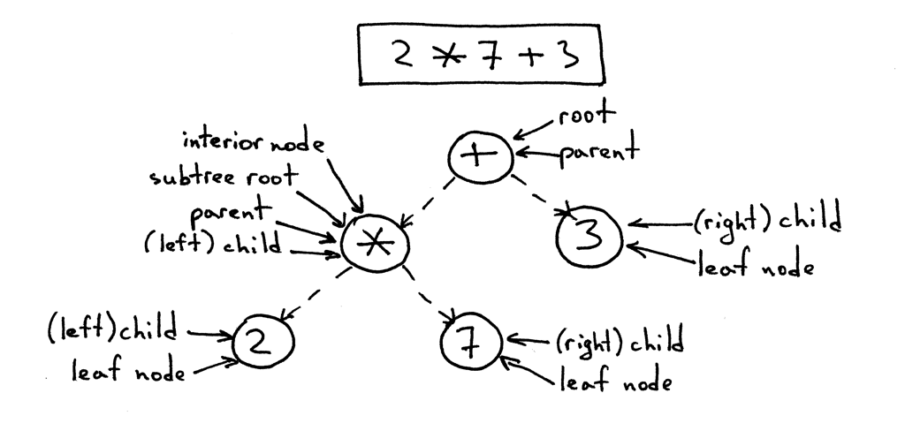

# *Let's Build a Simple Interpreter* Part 7: 抽象语法树

像我上次承诺的那样，今天我要对一些将要用的本系列文章结束时的核心数据结构展开讨论。准备好了吗？要出发了。

直到现在，我们已经把解释器和解析器的代码集成到一起了，并且使它可以在识别到确定的语法结构时，可以计算表达式的值，例如加减乘除等。这样的解释器我们称为**语法制导**的解释器。这类解释器通常会遍历一次输入，适用于基础的语言应用。为了分析更复杂的Pascal语言的语法结构，我们需要构建语言的中间表示（Intermediate Representation，IR）。我们的解析器需要构建正确的IR，而计时器将利用它去解释执行由IR表述的输入。

这样一来，二叉树（或者更广泛意义上的树）是一种非常适合表示表示IR的数据结构。

让我们来迅速的回顾一下二叉树的术语：

- 二叉树是一种由至少一个节点、带有层次结构的数据结构；
- 二叉树拥有一个位于顶部的根节点；
- 除了根节点以外，每个节点都拥有父节点；
- 以下图为例，节点`'*'`是一个父节点，而节点`2`和节点`7`是它的子节点；子节点从左到右排序；
- 没有子节点的节点称为叶节点；
- 一个拥有至少一个子节点的非根节点称为内部节点；
- 子节点可以是一棵完全二叉树，下图中的根节点`+`的左子树（根节点为`*`）和它的子节点构成完全二叉树；
- 在计算机科学中，我们通常自上而下地绘制二叉树，从根节点开始，分支向下生长。

下面是表达式$2*7+3$的语法树表示：

即将在整个系列文章余下部分用到的IR叫做抽象语法树（Abstract Syntax Tree, AST）。但是在我们深入了解AST之前，要简要的讨论一下解析树。尽管我们在解释器中不再使用解析树，但是它通过执行路径可视化可以帮助你理解解析器是如何解释输入的。我们还要比较一下为什么AST比解析树更适合做IR。

那么，解析树什么？一般解析树（偶尔也称为具体语法树）是一种根据我们的语法定义表示语言结构的句法结构。它从基本上向你展示了解析器如何识别语言结构的，或者换句话讲，它展示了一门编程语言中语法的开始符号如何派生出确定的字符串[^1]。

[^1]: 字符串：原文为*string*，此处存疑

解析器的调用堆栈隐式表达了一个解析树，当你的解析器尝试识别某种语言结构时就会将其自动建立在内存中。

让我们看看表达式$ 2 * 7 + 3 $的解析树：

